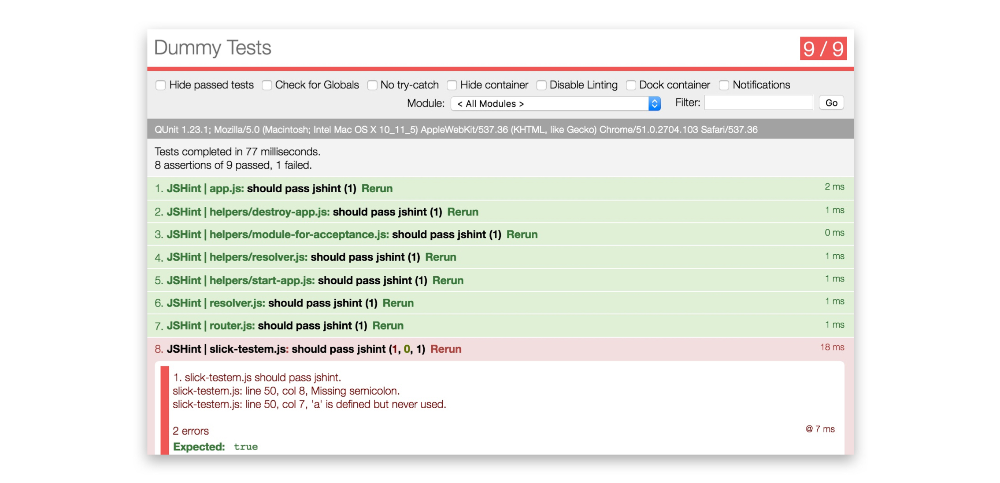

# Slick-testem

Some minor adjustments to make Test'em slick!



* Fast Failing Notification
* Lighter Interface
* More coming soon!

Quickstart: `ember install slick_testem`.

## Development

This runs on `http://localhost:4649`.

`ember generate slick_testem` will load/reload the current `.js` and
`.cs` files we are using to customize testem.

All customization will happen;

```
/blueprints/slick_testem/files/tests/slick-testem.css
/blueprints/slick_testem/files/tests/slick-testem.js
```

After running the generator, you will be able to see your customizations inside
of testem: http://localhost:4649/tests

## Installation

* `git clone` this repository
* `npm install`
* `bower install`

## Running

* `ember server`
* Visit your app at http://localhost:4649.

## Running Tests

* `npm test` (Runs `ember try:testall` to test your addon against multiple Ember versions)
* `ember test`
* `ember test --server`

## Building

* `ember build`

For more information on using ember-cli, visit [http://ember-cli.com/](http://ember-cli.com/).
